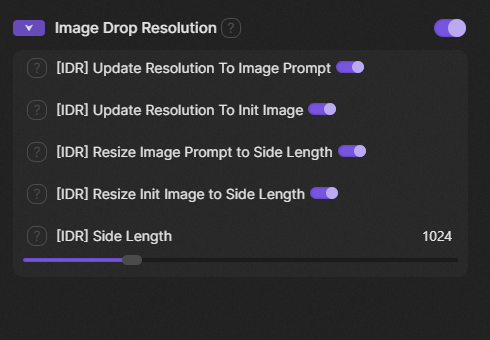

# SwarmUI Image Drop Resolution

A [SwarmUI](https://github.com/mcmonkeyprojects/SwarmUI) extension that automatically sets the generation resolution (width/height) to match the dimensions of an image dropped or pasted onto the image prompt area, and optionally resizes the image itself to a configurable target size.

## Screenshot



## Features

- **Auto-resolution from image prompt**: When you drop or paste an image onto the image prompt area, the output **Width** and **Height** inputs are updated to match the image dimensions, and **Aspect Ratio** is set to `Custom`.
- **Auto-resolution from init image**: When an image is set as the Init Image, the same resolution-update logic applies automatically.
- **Image prompt resizing**: Dropped/pasted image prompt images are automatically scaled to a configurable target area while preserving the original aspect ratio. Dimensions are rounded to the nearest multiple of 16, as required by most AI image models.
- **Init image resizing**: The same scaling logic can be applied independently to the Init Image.
- **Side Length slider**: Controls the target side length for both resize features (64–4096, default 1024). Images are scaled so their total pixel area approximates `side length × side length`.
- **Global enable/disable toggle**: The **Image Drop Resolution** group header has a master on/off toggle that disables the entire extension without changing any individual settings.
- **Per-feature toggles**: Each of the four behaviours (update resolution for image prompt, update resolution for init image, resize image prompt, resize init image) has its own independent toggle — any combination can be enabled at once.

## Installation

1. Navigate to your SwarmUI `Extensions` folder.
2. Clone this repository:
   ```
   git clone https://github.com/GlenCarpenter/SwarmUIImageDropResolution.git
   ```
3. Restart SwarmUI.

## Usage

1. Open the **Generate** tab in SwarmUI.
2. Drop or paste an image onto the image prompt area, or set an Init Image.
3. Find the **Image Drop Resolution** parameter group in the inputs sidebar. All five controls are on by default:

| Control | Default | Description |
|---|---|---|
| Group toggle (header) | On | Master switch — disables the entire extension when off. Individual settings are preserved. |
| **[IDR] Update Resolution To Image Prompt** | On | Updates Width/Height to match the dropped/pasted image prompt image. |
| **[IDR] Update Resolution To Init Image** | On | Updates Width/Height to match the Init Image. |
| **[IDR] Resize Image Prompt to Side Length** | On | Resamples the image prompt image to the calculated target dimensions before use. |
| **[IDR] Resize Init Image to Side Length** | On | Resamples the Init Image to the calculated target dimensions before use. |
| **[IDR] Side Length** | 1024 | Target side length used by both resize features. The image area approximates `side length²` pixels. |

The resize and resolution-update features are fully independent — you can resize an image without updating the resolution inputs, or update the resolution inputs to match the original dimensions without resampling the image.
